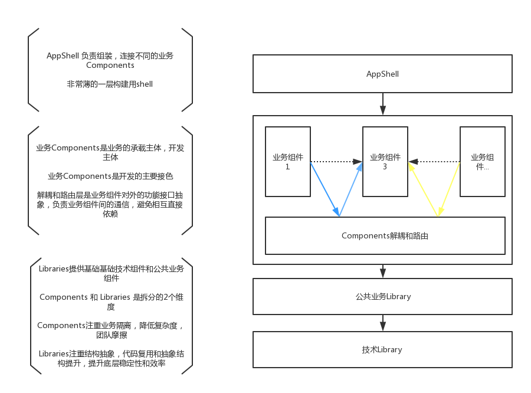
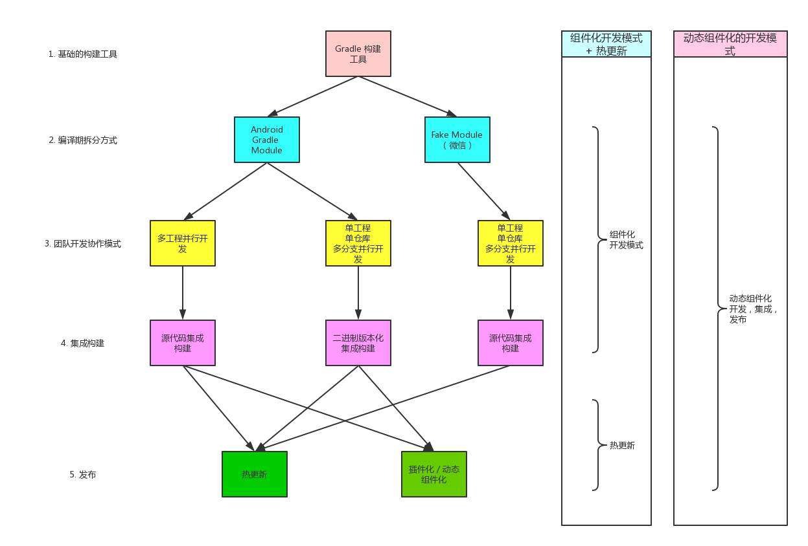

### App 架构

### 工程拆分和团队协作方式

### 概念

**1. 组件化开发**
> 1. 主要是为了解决团队协作，工程拆分，应用结构组织和划分的能力
> 2. 和动态能力没有必然联系

**2. 动态组件化**
> 1. 组件化的进一步进化，可以实现运行期的组概念，组建的更新，降级，增删等
> 2. 组件化的开发模式是必要条件

**3. 插件化**
> 1. 关注拆分和线上插件的插拔
> 2. 项目拆分是必要条件

**4. 热更新**
> 1. 重点关注是线上bugfix 和 小功能升级
> 2. 一般不支持四大组件更新（无法直接完成大量功能更新）
> 3. Android上主要是一些hack方案

**5. 动态化的能力**
> 1. 热更新和插件化本质上是一种hack方案，多多少少会面临适配问题，国内厂商改造系统的风气，适配问题更多。
> 2. 类似RN，Weex，Flutter是另一种形式的动态化能力，通过抽象层实现动态化，几乎不存在hack的问题

**6. hotfix**
> 线上的bugfix，进一步讲是：运行中的app可以修复bug，不用等到下次启动修复

### 中小型团队的实际情况

1. 中等规模的移动团队，中等规模的业务复杂度，中等规模的用户良机
2. 移动端没有建设起持续交付的基础设置和能力
3. 没有编译工具构建，开发效率人力和知识经验储备
4. 快速发展，积累了一定的技术债务没有偿还
5. app架构还不够清晰，架构改造的初期阶段
6. 业务还在快速的演进
7. 工程化拆分的非常早期的阶段

### 应用插件化可能遇到的问题
1. 打包流程改造的问题
2. 适配问题
3. 版本管理问题，各个插件依赖版本的问题（动态）
4. 应用路径比较长，拆分是先决条件
5. 底层API变动的问题（线上动态的情况）
6. 集成和构建工具的问题

### 建议路径（组件化开发 + 热更新能力）
1. 工程上微信的fake module
2. 工程上简单，不需要改造编译流程，集成流程
3. 不需要复杂的基础设置建设（maven管理等）
4. Components没有版本的概念，热更新整体升级，简单直白的升级逻辑
5. 拆分是渐进的，不拆分也可以做热更新
6. 热更新对项目拆分没有要求
7. 和现有的开发模式最接近，没有学习成本
8. 配合热更新可以做紧急版本的发布，线上严重bugfix
9. 结合一定的抽象和内置占位组建，可以实现大部分的业务功能更新
10. 配合freeline／fastdex 可以解决编译慢的问题
11. 支持渐进拆分
12. 拆分可以到非常小的粒度

**整体上来说：**
最简单的方案，技术挑战最小，项目结构也能进一步清晰化，可以快速的集成热更新能力，满足现在和未来可预期一段时间内的发布需求

----

### 目标
高效的开发高质量的应用

**高效：**
1. 开发效率上的高效
2. 团队协作的高效
3. 测试的高效
3. 新功能，业务交付用户的高效
4. 线上运维的高效
5. 运营的高效

**高质量：**
（从终端用户角度出发定义）
1. 用户体验良好（界面的卡顿，视频的卡顿）
2. 资源消耗合理（电量，内存，cpu，发热等等）
3. 崩溃率／ANR率／黑屏率
4. 可以衡量的线上终端用户感受到的质量
5. 质量问题的预防／卡口体系

**要达到目标需要做到的：**
1. 技术债务
2. App架构 
3. 工程拆分和团队合作 
4. 质量体系建设
5. 自动化的测试体系
6. 持续集成和持续交付系统

**核心点：**
1. 清晰的，低耦合的app架构
2. 工程化拆分，方便团队协作，降低摩擦和整体复杂度
3. 持续交付的体系建设和质量保证体系建设
4. 不断的积累稳定高效的基础类库

**理念->提高层次，降低复杂度:**

架构上降低设计复杂度，拆分降低团队协作复杂度，持续交付降低工程复杂度。基础类库，提高抽象层次。

----
[Android彻底组件化方案实践](http://www.androidchina.net/7445.html)

[微信Android模块化架构重构实践](https://juejin.im/entry/596c60485188254b772dba2a)
